## Nama: NAhrul Wijaya
## Nim: 312010415
## Kelas: TI.20.A1

### Langkah langkah praktikum 11

1. Buat file baru dengan nama header.php

## Instalasi Codeigniter 4
Untuk melakukan instalasi Codeigniter 4 dapat dilakukan dengan dua cara, yaitu cara manual dan menggunakan composer. Pada praktikum ini kita menggunakan cara manual

• Unduh Codeigniter dari website https://codeigniter.com/download

• Extrak file zip Codeigniter ke direktori htdocs/lab11_ci.

• Ubah nama direktory framework-4.x.xx menjadi ci4.

• Buka browser dengan alamat http://localhost/lab11_ci/ci4/public/

2. Membuat Route Baru.
Tambahkan kode berikut di dalam Routes.php

Selanjutnya coba akses route yang telah dibuat dengan mengakses alamat url http://localhost:8080/about

Ketika diakses akan mucul tampilan error 404 file not found, itu artinya file/page tersebut tidak ada. Untuk dapat mengakses halaman tersebut, harus dibuat terlebih dahulu Contoller yang sesuai dengan routing yang dibuat yaitu Contoller Page.

Selanjutnya refresh Kembali browser, maka akan ditampilkan hasilnya yaitu halaman sudah dapat diakses.

3. Auto Routing

Secara default fitur autoroute pada Codeiginiter sudah aktif. Untuk mengubah status autoroute dapat mengubah nilai variabelnya. Untuk menonaktifkan ubah nilai true menjadi false.
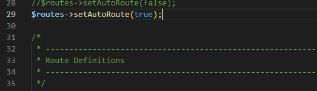
Tambahkan method baru pada Controller Page seperti berikut.

Method ini belum ada pada routing, sehingga cara mengaksesnya dengan menggunakan alamat: http://localhost:8080/page/tos

4. Membuat View

Selanjutnya adalam membuat view untuk tampilan web agar lebih menarik. Buat file baru dengan nama about.php pada direktori view (app/view/about.php) kemudian isi kodenya seperti berikut.

Ubah method about pada class Controller Page menjadi seperti berikut:

Kemudian lakukan refresh pada halaman tersebut.

5. Membuat Layout Web dengan CSS
Buat file css pada direktori public dengan nama style.css (copy file dari praktikum lab4_layout. Kita akan gunakan layout yang pernah dibuat pada praktikum 4.

Kemudian buat folder template pada direktori view kemudian buat file header.php dan footer.php

File app/view/template/footer.php

Kemudian ubah file app/view/about.php seperti berikut.

Selanjutnya refresh tampilan pada alamat http://localhost:8080/about

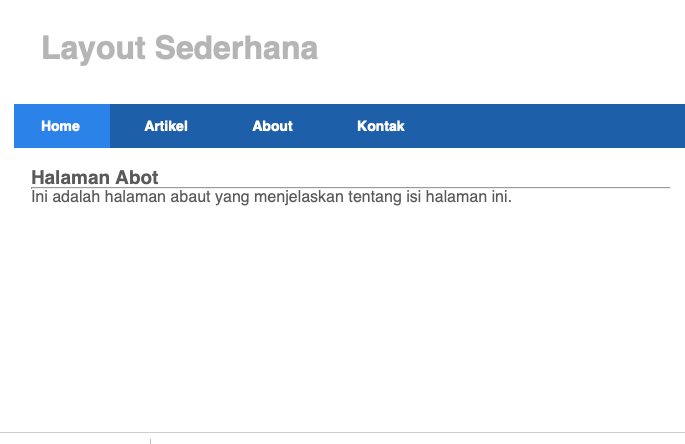

## Lab 12 (Lanjutan)

1. Membuat Database: Artikel Data Studi Kasus

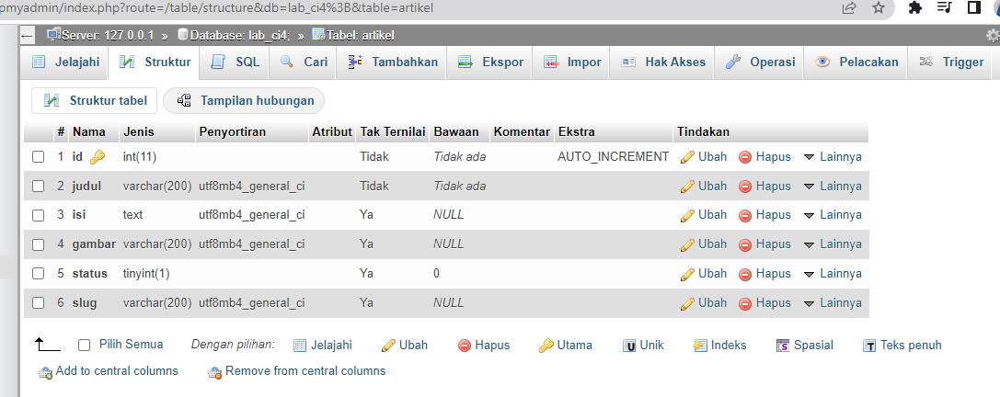

Setelah database berhasil dibuat. Selanjutnya proses pembuatan tabel pada database tersebut. Pembuatannya sama dengan sebelumnya, kalian hanya perlu menekan tombol MySQL pada Database sebelumnya kemudian masukan kode berikut:

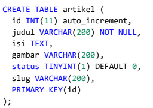

## KONFIGURASI KONEKSI DATABASE

Konfigurasi dapat dilakukan dengan dua cara. Pertama, pada dua file app/config/database.php atau yang kedua menggunakan file .env seperti yang akan saya gunakan dengan menghapus tanda # pada bagian database seperti dibawah.

Membuat View
Buat direktori baru dengan nama artikel pada direktori app/views, kemudian buat file
baru dengan nama index.php.

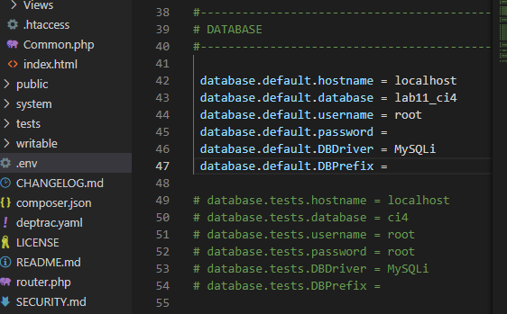

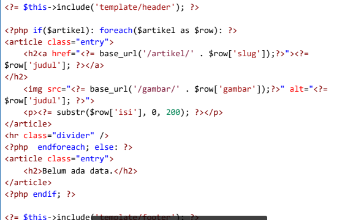

## Hasilnya

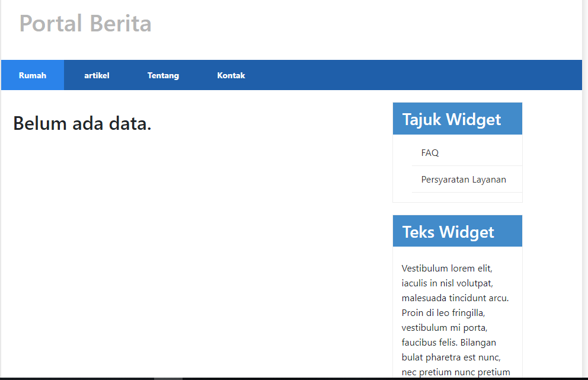

Membuat View
Buat direktori baru dengan nama artikel pada direktori app/views, kemudian buat file
baru dengan nama index.php.
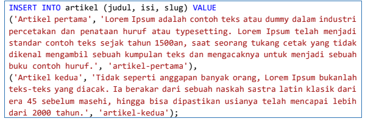

## Hasilnya
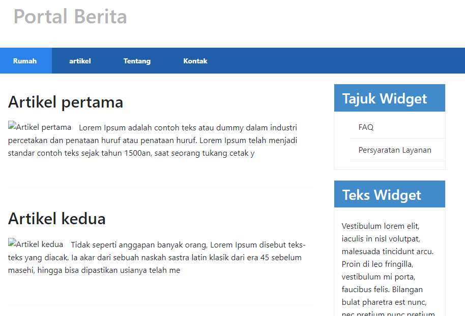

Membuat View
Buat direktori baru dengan nama artikel pada direktori app/views, kemudian buat file
baru dengan nama index.php.

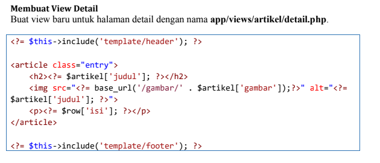

## Hasilnya

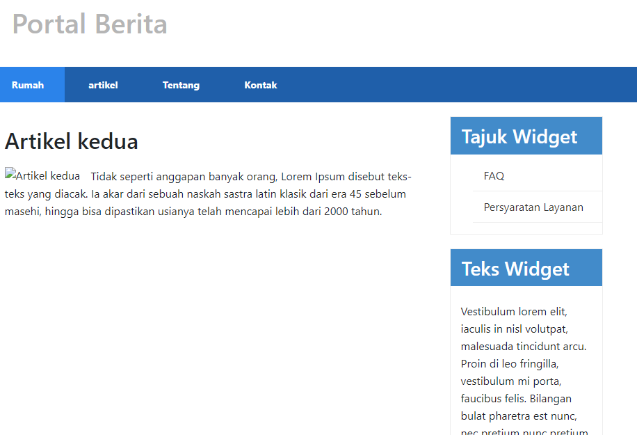

Membuat Menu Admin
Menu admin adalah untuk proses CRUD data artikel. Buat method baru pada
Controller Artikel dengan nama admin_index().

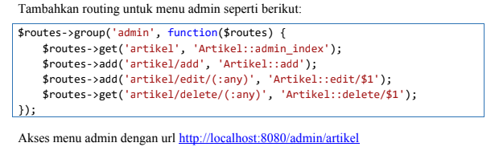

## Hasilnya

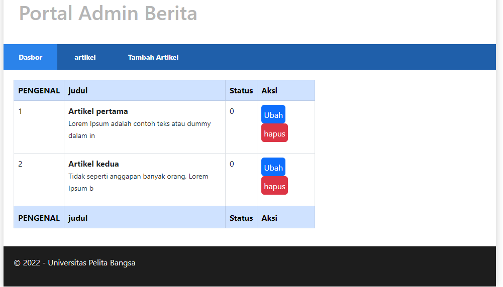

